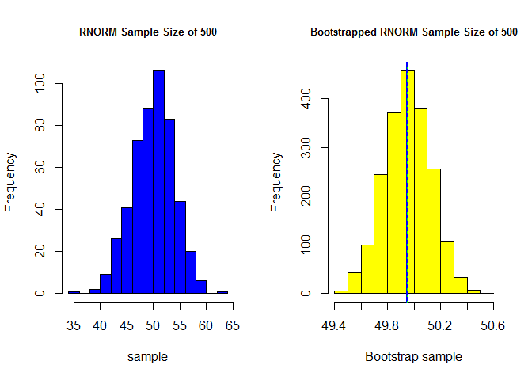

# MSDS 6306: Introduction to Data Science (402) Homework-4
Rajni Goyal  
October 19, 2016  

####Assignment - Write bootstrap code to illustrate the central limit theorem in R markdown and push the result to GitHub. Use a normal distribution with two different sample sizes and an exponential distribution with two different sample sizes. 


### Functions Used:
####Two functions were used to illustrate the Central Limit Theorem for normal distribution and exponential distribution.BootMeanFunction is used to receive number and type of samples to be generated and number of bootstrap samples to be collected, produces bootstrap samples, and returns the sample mean, sample standard deviation, and bootstrap sample means. And Analyze function is used to process bootMeanFunction() returned values and produces bootstrap mean summary statistics, and standard error of the sample mean. Additionally, bootstrap mean histograms are plotted for comparison to sample histograms and random sample's and bootstrap sample's standard deviations are displayed.


```r
# Function: bootMeanFunction()
# Inputs:   n = number of samples collect
#           nSimulations = number of bootstrap sample simulations
#           distType = specifies distribution type 
# Outputs:  xbar = norm distribution sample mean
#           sdSample = norm distribution sample standard deviation
#           bootnorm = vector of bootstrap sample means
#           print - prints random sample summary statistics
#           plots - plots histogram of sample data
# Descrip: Receives number and type of samples to be generated and number of bootstrap samples to
#          be collected, produces bootstrap samples, and returns the sample mean, sample standard 
#          deviation, and bootstrap sample means.


bootMeanFunction <- function(n, nSimulations, distType) {
    
# We use conditional statement here to collect samples based on normal or exponential distribution
# and generate histograms of sample data
    if(distType == "r") {
        sample <- rnorm(n, 50, 4)
        hist(sample, main = paste("RNORM Sample Size of", n), col = "blue")
    }
    else if(distType == "e") {
        sample <- rexp(n)
        hist(sample, main = paste("REXP Sample Size of", n), col = "blue")
    }
    
# We assign sample standard deviation and mean to variables here
    sdSample <- sd(sample)
    xbar <- mean(sample)
    
# Prints random sample summary results 
    cat("Random Normal sample summary statistics:\n")
    print(summary(sample))
    
# Initializes bootnorm vector as numeric type of size 'nSimulations'
    bootnorm <- numeric(nSimulations)
    
# Run bootstrap sequence and save temp means to bootnorm vector
    for (i in 1:nSimulations){
        temp <- sample(sample, size = length(sample), replace = TRUE)
        bootnorm[i] <- mean(temp)
    }
    
# Return sample mean, standard deviation, and vector of bootstrap means here using c vector
    return(c(xbar,sdSample,bootnorm))
}
```


```r
# Function: analyze()
# Inputs:   N = number of sample data to collect
#           repeats = number of bootstrap sample repeats
#           DistTYPE = distribution type specifier
# Outputs:  print(summary(BOOTMean)) - prints random sample's summary statistics
#           print - prints bootstrap sample's summary statistics
#           print - prints bootstrap sample's standard deviation
#           print - prints standard error of the sample mean
#           plots - plots histogram of bootstrap means
#
# Descrip: Receives number and type of samples to be generated and number of bootstrap samples to be
#          collected, and passes these values to the bootMeanFunction() function.Processes bootMeanFunction()
#          returned values and produces bootstrap mean summary statistics, and standard error of
#          the sample mean. Additionally, bootstrap mean histograms are plotted for comparison to sample
#          histograms and random sample's and bootstrap sample's standard deviations are displayed.

analyze <- function(N, repeats, DistType) {
    
# Obtain sample mean, sample sd, and bootstrap mean from random distribution
    funcReturn <- bootMeanFunction(N, repeats, DistType)
    sampleMean <- funcReturn[1]
    sampleSD <- funcReturn[2]
    BootNorm <- funcReturn[-1:-2]
    
# Prints bootstrap mean summary results here
    cat("Bootstrap sample's summary statistics:\n")
    print(summary(BootNorm))
    
# Run conditional statement to print correct histogram here
    if(DistType == distNorm) {
        hist(BootNorm, main = paste("Bootstrapped RNORM Sample Size of", N),
             xlab = "Bootstrap sample", col = "yellow")
    }
    else if(DistType == distExp) {
        hist(BootNorm, main = paste("Bootstrapped REXP Sample Size of", N),
             xlab = "Bootstrap sample", col = "yellow")
    }
# Add sample mean and bootstrap mean of means lines for comparison in bootstrap histogram
    abline(v = sampleMean, col = "blue", lwd = 2)
    abline(v = mean(BootNorm), col = "green", lwd = 2, lty = 3)
    
# Print random sample and bootstrap standard deviations and standard error
    print(paste("Standard Deviation of Random Normal Samples  =",round(sampleSD,4)))
    print(paste("Standard Deviation of Bootstrap Means =",round(sd(BootNorm),4)))
    print(paste("Standard Error of the Sample Mean =",round((sampleSD/sqrt(N)),4)))
}
```

<br>

### Bootstrapping Setup:
##### I'm initializing my variables to collect sample sizes of 50 and 500 for both random normal and random exponential sampling to see how different sample sizes perform when they're bootstrapped. For bootsrap sample collection, I've chosen my repeats to be 2000 bootstrap samples.

```r
# Initializing the variables
repeats <- 2000 # Number of bootstrap samples to collect
distNorm <- "r" # Random Normal distribution selection
distExp <- "e" # Exponential distribution selection
sample1 <- 50
sample2 <- 500
```

<br>

### Normal Distribution Outputs - Sample Size of 50

```r
## Set graphical parameters for histograms
par(mfrow = c(1, 2), cex.main = 0.8)  # 2 rows and 2 columns with title text shrink by 20%

## Normal Distribution 50 Samples - Demonstration of Central Limit Theorem
analyze(sample1, repeats, distNorm)
```

```
## Random Normal sample summary statistics:
##    Min. 1st Qu.  Median    Mean 3rd Qu.    Max. 
##   41.55   47.41   49.97   49.85   52.17   58.90 
## Bootstrap sample's summary statistics:
##    Min. 1st Qu.  Median    Mean 3rd Qu.    Max. 
##   48.28   49.47   49.82   49.83   50.18   52.02
```

<!-- -->

```
## [1] "Standard Deviation of Random Normal Samples  = 3.791"
## [1] "Standard Deviation of Bootstrap Means = 0.5262"
## [1] "Standard Error of the Sample Mean = 0.5361"
```

<br>

### Normal Distribution Outputs - Sample Size of 500

```r
## Set graphical parameters for histograms
par(mfrow = c(1, 2), cex.main = 0.8)  # 2 rows and 2 columns with title text shrink by 20%

## Normal Distribution 500 Samples - Demonstration of Central Limit Theorem
analyze(sample2, repeats, distNorm)
```

```
## Random Normal sample summary statistics:
##    Min. 1st Qu.  Median    Mean 3rd Qu.    Max. 
##   37.83   47.30   50.43   50.18   52.96   62.66 
## Bootstrap sample's summary statistics:
##    Min. 1st Qu.  Median    Mean 3rd Qu.    Max. 
##   49.43   50.06   50.18   50.18   50.31   50.78
```

<!-- -->

```
## [1] "Standard Deviation of Random Normal Samples  = 3.9698"
## [1] "Standard Deviation of Bootstrap Means = 0.1798"
## [1] "Standard Error of the Sample Mean = 0.1775"
```

<br>

### Exponential Distribution Outputs - Sample Size of 50

```r
## Set graphical parameters for histograms
par(mfrow = c(1, 2), cex.main = 0.8)  # 2 rows and 2 columns with title text shrink by 20%

## Exponential Distribution 50 Samples - Demonstration of Central Limit Theorem
analyze(sample1, repeats, distExp)
```

```
## Random Normal sample summary statistics:
##    Min. 1st Qu.  Median    Mean 3rd Qu.    Max. 
## 0.04376 0.32070 0.77190 1.03500 1.29700 5.46000 
## Bootstrap sample's summary statistics:
##    Min. 1st Qu.  Median    Mean 3rd Qu.    Max. 
##  0.6156  0.9402  1.0330  1.0380  1.1280  1.5660
```

<!-- -->

```
## [1] "Standard Deviation of Random Normal Samples  = 1.0136"
## [1] "Standard Deviation of Bootstrap Means = 0.1402"
## [1] "Standard Error of the Sample Mean = 0.1433"
```

<br>

### Exponential Distribution Outputs - Sample Size of 500

```r
## Set graphical parameters for histograms
par(mfrow = c(1, 2), cex.main = 0.8)  # 2 rows and 2 columns with title text shrink by 20%

## Exponential Distribution 500 Samples - Demonstration of Central Limit Theorem
analyze(sample2, repeats, distExp)
```

```
## Random Normal sample summary statistics:
##     Min.  1st Qu.   Median     Mean  3rd Qu.     Max. 
## 0.001248 0.284200 0.708700 1.015000 1.345000 6.388000 
## Bootstrap sample's summary statistics:
##    Min. 1st Qu.  Median    Mean 3rd Qu.    Max. 
##  0.8628  0.9819  1.0140  1.0140  1.0450  1.1990
```

<!-- -->

```
## [1] "Standard Deviation of Random Normal Samples  = 1.0316"
## [1] "Standard Deviation of Bootstrap Means = 0.0469"
## [1] "Standard Error of the Sample Mean = 0.0461"
```

<br>


### Review:
##### As can be seen above, the Central Limit Theorem is clearly displayed when comparing the effects of bootstrapping on randomized sample sizes of 50 and 500. This applies for both random normal and exponentially distributed data. We further find out that the mean of the original random sample data and the mean of the bootstrapped data are practically equal as in Central Limit Theorem.. We're treating the original data as the population, so when taking many samples from this population and calculating the mean of the samples, the bootstrap sample mean is expected to be closer to the original data.And when we plot the original data and the bootstrapped data on the histogram, we see that the bootstrapped data is more normal than the original population data. And this is true for exponentially distributed samples as well. It's important to note that sample sizes of 500 seem to distribute more normally distributed and compact when bootstrapping than the sample size of 50. Also note that the original sample mean is drawn as a blue line on the bootstrap histograms and bootstrap mean is drawn in dotted green to compare the mean values referenced in the summary statistics.Finally, the random samples and bootstrap samples standard deviations further confirm that standard deviation also improves with the implementation of the Central Limit Theorem. 
